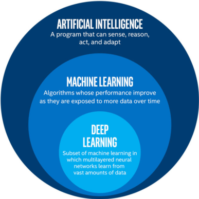

# Overview

[`Python is an interpreted, high-level, general-purpose programming language. Created by Guido van Rossum and first released in 1991, Python's design philosophy emphasizes code readability with its notable use of significant whitespace. Its language constructs and object-oriented approach aim to help programmers write clear, logical code for small and large-scale projects.`](<https://en.wikipedia.org/wiki/Python_(programming_language)>)

## Understanding the misconception between **`ML, DL & AI`**


Picture
Source :Nvidia
Picture
The misconception around AI, ML and DL are increasing every day.
After doing some researches and asking questions about what people think these 3 terms are, I came to a conclusion that they are been misunderstood. Do you know what they mean apparently?

- **Artificial Intelligence (AI)**: is an of making machines behave and react like humans. That is humans program this machines to make them think and act like us. According to Wikipedia, it is a simulation of human intelligence.
  [Read more on artificial intelligence](https://en.wikipedia.org/wiki/Artificial_intelligence)

- **Machine Learning (ML)**: is a part of AI that involves the use of statistics to teach a computer how to learn or tool used to teach machine making use of traditional machine learning algorithms. ML is almost similar to computational statistics. For more reading, visit ML Wikipedia

- **Deep Learning (DL)**: is also known as hierarchical learning. DL is part of the ML methods used in AI. So you can see where the connection is. Altogether is a subset of AI and ML that automatically learn from representations from data such as images, text, without hand-coded rules or human domain knowledge.
  ​
  One of many of the recent breakthroughs of DL in AI is the Google DeepMind's Alpha Go. In October 2015, AlphaGo became the first computer Go program to beat a human professional Go player without handicaps on a full-sized 19×19 board. Read more AlphaGo.

Each one of these concepts has its own strengths and weakness. It all depends on the situation you have at hand and the volume of your data.

​Now you can see how they are interconnected with each other. All of them cannot survive without data.

## Difference between a **Data Analyst** & **Data Scientist**

If you have an analytical mindset and love decoding data to tell a story, you may want to consider a career as a data analyst or data scientist. After all, they are two of the hottest jobs in tech (and pay pretty well, too).

> [Harvard Business Review](https://hbr.org/2012/10/data-scientist-the-sexiest-job-of-the-21st-century) even awarded “data scientist” the title of “sexiest job of the 21st century.”

> Data science and analytics (DSA) jobs are in high demand. According to [Forbes](https://www.forbes.com/sites/louiscolumbus/2017/05/13/ibm-predicts-demand-for-data-scientists-will-soar-28-by-2020/#41868bca7e3b), “by 2020 the number of Data Science and Analytics job listings is projected to grow by nearly 364,000 listings to approximately 2,720,000.” They aren’t the easiest positions to fill, either. Forbes goes on to say that DSA jobs “remain open an average of 45 days, five days longer than the market average.”

Even people who have some basic knowledge of data science have confused the data scientist and data analyst roles. So, what’s the difference between a data scientist and a data analyst? Both work with data, but the key difference is what they do with this data.

- **Data analysts** sift through data and seek to identify trends. What stories do the numbers tell? What business decisions can be made based on these insights? They may also create visual representations, such as charts and graphs to better showcase what the data reveals.

- **Data scientists** are pros at interpreting data, but also tend to have coding and mathematical modeling expertise. Most data scientists hold an advanced degree, and many actually went from data analyst to data scientist. They can do the work of a data analyst, but are also hands-on in machine learning, skilled with advanced programming, and can create new processes for data modeling. They can work with algorithms, predictive models, and more.

Please read more [Here](https://www.springboard.com/blog/data-analyst-vs-data-scientist/)

## JupyterNotebook installation

- going through the installation for Mac and Windows

## Get inspired by things built with Python already

- [Google Duplex](https://www.youtube.com/watch?v=D5VN56jQMWM)
- [Microsoft’s Semantic Machines Showcases New Conversational AI Technology](https://www.youtube.com/watch?v=G_v5B_gYceM)

## Data Types & Operators

- Integer `1,2,3,4,5`
- floats `1.23, 44.45, 203.67`
- strings `hello, hi there, what is new, i am a emoji, haha`
- boolean `true, false`

Operators:

- `+`
- `-`
- `*`
- `/`
- `<`
- `>`
- `<=`
- `>=`

## Variables

```python

a = 2
b = 'Hellworld'
c = true
print(a) ## python version  3..
print a ## python version 2.7
```

## Data Structures

There are various data types in python. The most common used once are :

- `sets`
- `list`
- `array`
- `dict`
- `str`
- `tuple`

## Exercise

> For some these exercises you do not have to code them right way but it is important you write down your `pseudocode`. _`pseudocode` is a breakdown of what you want your `code` to do._

> ```python
> /*
> # you want to add 2 digits or numbers together.
> # your pseucode will look like this.
> """
>  -> get the first number
> -> get the second number
> -> using addition sign to add them together
> -> show the result of the addition """
> ```

> Question :
>
> - Write a array that contains some sets of numbers.
> - Write an expression that calculates the average of 3 numbers and print your output.

> Quiz : In the fishy situation below, some of the quantities are of type int and some are of type float. Check all the ones that should be of type float.

- [ ] How many people came on your fishing trip
- [ ] Length of a fish you caught, in meters
- [ ] Number of fish caught on a fishing trip
- [ ] Length of time it took to catch the first fish, in hours

> What happens if you divide by zero in Python? Try it out! Test run this code and see what happens.

````python
  print(5/0) ```
````

```python
sf_population, sf_area = 864816, 231.89
rio_population, rio_area = 6453682, 486.5

san_francisco_pop_density = sf_population/sf_area
rio_de_janeiro_pop_density = rio_population/rio_area

# Write code that prints True if San Francisco is denser than Rio, and False otherwise

```

## Program Flow

Use control flow to handle the logics of your implementation.

- Conditional Statement
  - `if` `else`
- Loops
  - `for`
  - `while`
  - `continue` and `break`
  - `zip` and `enumerate`
- `list comprehension`
  > There are more that was not mentioned in this presentation.

### Exercise

```python
# TODO: Fix this string!\
ford_quote = 'Whether you think you can, or you think you can't--you're right.'
```

> Quiz: What Type Do These Objects Have?
>
> - What type does this object have? `'12'`.
> - What type does this object have? `12.3`
> - What type does this object have? `len("my_string")`
> - What type does this object have? `"hippo" * 16`

## String Methods

`len("this")`

`type(12)`

`print("Hello world")`


```python
# what are the expected output ?
new_str = "The cow jumped over the moon."
new_str.split()
```

> String Methods Coding Practice
>
> - What is the length of the string variable verse?
> - What is the index of the first occurrence of the word 'and' in verse?
> - What is the index of the last occurrence of the word 'you' in verse?
> - What is the count of occurrences of the word 'you' in the verse?

```python

verse = "If you can keep your head when all about you\n  Are losing theirs and blaming it on you,\nIf you can trust yourself when all men doubt you,\n  But make allowance for their doubting too;\nIf you can wait and not be tired by waiting,\n  Or being lied about, don’t deal in lies,\nOr being hated, don’t give way to hating,\n  And yet don’t look too good, nor talk too wise:"
print(verse)

# Use the appropriate functions and methods to answer the questions above
```

## Functions

> A function is a block of organized, reusable code that is used to perform a single, related action. Example of function is the built python `print` used to display expression or whatever you want display to the screen.

These are logics we use to handle repetitive task. Think of it as you want _an application that take any number and do basic arithmetic computation_. You can say an place where you

When defining a function, several parts needs to be considered. These are :

- **Function Header**

  - The function header always starts with the `def` keyword, which indicates that this is a function definition.
  - Then the function name comes. Note that function names follows the same naming conventions as variables.
  - Immediately, after the parenthesis we have the function `parameters`, then you close the parenthesis. `parameters` are input you want to pass into the function when it is called.
  - Then we have the `:`. This always end the header

- **Function Body**
  - this is where the magic happens.
  - we define the argument variables and new variables we want to use here.

> - create 3 variables with different data types.
> - Write a function that returns the `Area` of a triangle.
> - Write a function that returns the `Perimeter` of a triangle.
> - Write a function that returns the `Area and Circumference` of a circle.
